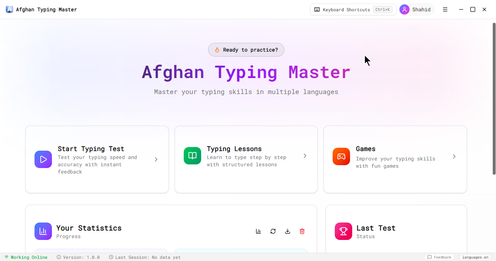
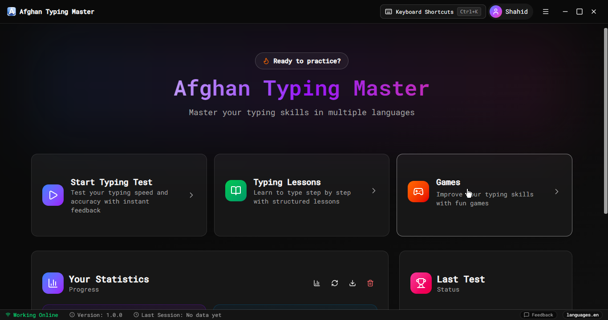
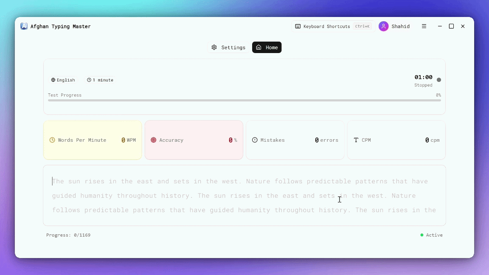
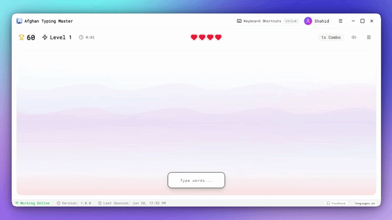
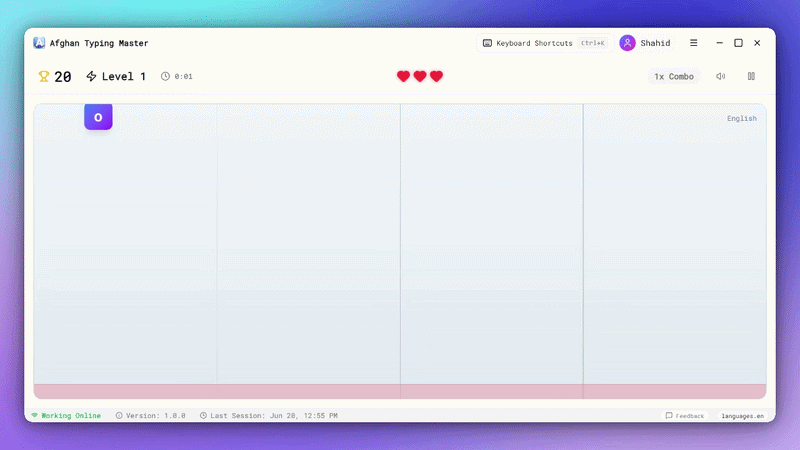
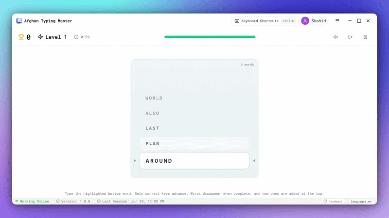

# Afghan Typing Master

### Master your typing skills in **English**, **پښتو (Pashto)**, and **دری (Dari)**

A modern desktop typing application designed to help users improve their typing speed, accuracy, and confidence in **English**, **Pashto**, and **Dari**.

Built specifically with Afghan language support, RTL typing, and national keyboard layouts in mind.

[Website](https://afghantypingmaster.com) · [Download](#-download) · [Features](#-features) · [Screenshots](#-screenshots) · [Support](#-feedback-and-support) · [License](#-license)

---

# 🇦🇫 Built with Afghan Languages in Mind

Most typing applications focus primarily on English. Afghan Typing Master was created to provide a better typing experience for users who work with **Pashto**, **Dari**, and **English** every day.

The application includes:

- Native Pashto typing support
- Native Dari typing support
- Proper right-to-left (RTL) text handling
- Afghan keyboard layouts
- Persian/Arabic script rendering
- Naskh and Nastaliq-friendly text display
- Lessons and practice designed for local language usage

Whether you are a student, teacher, office worker, journalist, translator, or language learner, Afghan Typing Master helps you build practical typing skills in the languages you use most.

---

# 📥 Download

Download the latest official Windows release:

## 👉 https://github.com/ShahidKhanDev/afghan-typing-master/releases/latest

### System Requirements

- Windows 10 or Windows 11
- 64-bit operating system
- Fully functional offline after installation
- Internet connection only required for updates and future online features

> If Windows SmartScreen appears during first launch, click **More Info → Run Anyway**.

---

# 📸 Screenshots

> Screenshots will be added here.

### Home Screen

#### Home Screen Light Mode

#### Home Screen Dark Mode

### Typing Test

### Word Falling Game

### Letter Rain Game

### Word Stack Game

---

# ✨ Features

## 🖋️ Typing Practice

- Practice typing in English, Pashto, and Dari
- Structured lessons from beginner to advanced
- Real-time speed and accuracy tracking
- Mistake detection and correction
- Adaptive practice based on previous mistakes
- Custom typing tests
- Focused character and key training

---

## 🎮 Typing Games

Learn while having fun with built-in typing games.

| Game         | Description                                           | Modes                          |
| ------------ | ----------------------------------------------------- | ------------------------------ |
| Word Falling | Type words before they reach the bottom of the screen | Easy / Medium / Hard           |
| Letter Rain  | Type falling letters and collect bonus points         | Easy / Medium / Hard           |
| Word Stack   | Clear stacked words by typing accurately              | Easy / Medium / Hard / Endless |

More games will be added in future releases.

---

## 🌍 Multi-language Support

- English (QWERTY)
- Pashto
- Dari
- RTL text support
- Afghan keyboard layouts
- Seamless language switching

---

## 📊 Progress & Analytics

Track your improvement over time with detailed statistics.

- Words Per Minute (WPM)
- Accuracy percentage
- Recent performance history
- Problem key analysis
- Mistake tracking
- Learning progress insights

---

## ⌨️ On-Screen Keyboard Guide

Perfect for beginners and language learners.

- Highlights the next key to press
- Visual keyboard guidance
- Learn correct finger placement
- Supports English, Pashto, and Dari layouts

---

## 🎨 Personalization

Customize your typing experience.

- Light Theme
- Dark Theme
- Keyboard Sound Effects
- Clean and distraction-free interface

---

## 🔄 Automatic Updates

Afghan Typing Master can automatically check for new versions and notify users when updates are available.

You can also manually download the latest version anytime from the official GitHub Releases page.

---

# 🎯 Who Is It For?

Afghan Typing Master is suitable for:

- Students
- Teachers
- Government employees
- Office workers
- Journalists
- Translators
- Data entry operators
- Call center staff
- Language learners
- Anyone who wants to improve typing speed and accuracy

---

# 📦 About This Repository

This repository serves as the official public release channel for Afghan Typing Master.

The application's source code is maintained privately and is not publicly available.

This repository provides:

- Official Windows installer downloads
- Release history and changelogs
- Documentation
- License information
- User support resources

Afghan Typing Master is free to download and use but is **not open source**.

Please see the LICENSE.txt file for complete licensing and redistribution terms.

---

# 🐛 Feedback and Support

If you encounter a bug, have a feature request, or would like to share feedback:

- Use the in-app feedback form
- Email: [support@afghantypingmaster.com](mailto:support@afghantypingmaster.com)
- Website: https://afghantypingmaster.com

Your feedback helps improve Afghan Typing Master for everyone.

---

# 👤 Author

**Shahid Ullah Safi**

Full Stack Developer from Kabul, Afghanistan

- Website: https://shahiddev.com
- Email: [contact@shahiddev.com](mailto:contact@shahiddev.com)
- GitHub: https://github.com/ShahidKhanDev

---

# 📄 License

Afghan Typing Master is distributed as **Proprietary Freeware**.

You may:

- Download and use the software free of charge
- Share the original, unmodified installer
- Install the software on multiple devices

You may not:

- Modify the software
- Reverse engineer or decompile the software
- Redistribute modified versions
- Repackage or resell the software
- Remove copyright notices

The source code is private and is not distributed publicly.

See [`LICENSE.txt`](LICENSE.txt) for full terms.

---

### 

Helping people type more confidently in **English**, **پښتو**, and **دری**.

**afghantypingmaster.com**

